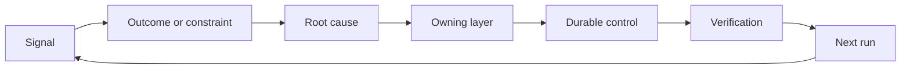

# Build a Feedback Ratchet with Ownership and Retirement

> Shipping closes one build loop and opens the learning loop. Evidence must change the system or it becomes telemetry nobody owns.

**Type:** Learn + Build
**Languages:** Python (stdlib)
**Prerequisites:** Phase 14 lessons 46 and 53
**Time:** ~75 minutes

## Learning Objectives

- Turn incidents, evaluations, user behavior, and corrections into owned actions.
- Route each signal to context, evaluation, policy, runtime, or backlog.
- Prioritize recurrence by severity and frequency.
- Give every control a retirement condition.
- Communicate a delivery decision with evidence, tradeoffs, and an accountable owner.

## Feedback Is Infrastructure

A team can collect traces, evaluations, support tickets, and incident logs without learning from any of them. The missing mechanism is promotion: a defined path from observation to a durable change with an owner and proof.

The loop is:

1. observe a concrete signal;
2. connect it to an outcome, constraint, or assumption;
3. identify the earliest system layer that owns the cause;
4. create a bounded change;
5. verify that recurrence becomes less likely;
6. review whether the control should remain.

## Route to the Owning Layer

| Signal | Destination |
|---|---|
| False positive, regression, wrong result | Evaluation or test |
| Missing context, duplicate work, stale fact | Context source or retrieval route |
| Unsafe action or authority gap | Policy or permission boundary |
| Timeout, retry storm, unavailable dependency | Runtime control |
| New product need or unresolved tradeoff | Shaped backlog item |

Fix the cause at the earliest effective layer. Do not add another prompt paragraph when a test or permission can make the failure impossible.



## Ownership Is Part of the Control

Every ratchet action needs:

- one owner;
- a priority based on consequence and recurrence;
- the artifact to change;
- the verification that proves the change;
- a review or expiry window;
- a retirement condition.

An unowned improvement is an observation with better formatting.

## Retire Stale Controls

Feedback systems accumulate policy. That policy can become contradictory and expensive. Review controls when:

- architecture or workflow changes;
- a lower-level invariant replaces a higher-level instruction;
- the protected failure has not appeared across the chosen window;
- the control blocks legitimate work more often than it prevents harm.

Retirement also needs evidence. Do not delete a control because it feels old.

## Connect Build and Coding-Agent Feedback

The same ratchet serves both tracks:

- Product evidence changes the outcome frame, assumptions, slice, or measurement plan.
- Coding-agent corrections change tests, context, scope, automation, or handoff.
- Incidents can change both the product boundary and the agent workbench.

This is why shaping the build is not a phase that ends before coding. It continues through every accepted change.

## Build It

The lab classifies signals, creates owned ratchet actions, prioritizes them, and writes `outputs/feedback-backlog.json`.

```bash
python3 code/main.py
python3 -m unittest discover code/tests -v
```

Add a runtime timeout signal and confirm that it routes to the runtime rather than the general backlog.

## Practice Lab: Own a Decision After a Setback

Choose one workflow from your career route's portfolio project. Carry it through one decision, a small experiment, and a review. Keep the evidence in the [career delivery template](https://github.com/rohitg00/ai-engineering-from-scratch/blob/main/phases/14-agent-engineering/54-build-the-feedback-ratchet/outputs/career-delivery-evidence.md).

The Python lab generates example backlog actions. It does not observe users, measure an intervention, or prove career readiness. Completing its run is preparation for this exercise.

### 1. Establish What Happened

Record the user, task, current workflow, and the outcome you wanted to improve. Link a consented observation, a redacted support record, or a reproducible task trace. Separate what you observed from what someone reported and what you inferred.

Find a setback: a failed assumption, an unusable result, an unexpected cost, or a delayed handoff. Explain which evidence changed your understanding. A setback needs a response and a decision, not a success story written around it.

If you cannot work with users, run a clearly labeled simulation with a peer or a stated scenario. Keep simulated observations separate from real-user evidence. Do not invent interviews, approvals, adoption, or business impact.

### 2. Make Progress Within Your Authority

List the unknowns and choose the cheapest reversible action that could resolve the most consequential one. State what you can decide, what is bounded by an existing agreement, and what needs authorization before execution.

For example, you may prepare a redacted offline replay while waiting for permission to use customer data. Taking initiative means moving authorized work forward and making the blocked decision clear. It does not expand your access or approval rights.

### 3. Compare Options and Brief the Decision Owner

Write a short decision brief for someone who does not need the implementation detail. Include:

- the user problem and the evidence that changed the plan;
- at least two options, including a cheaper manual or no-build option where credible;
- quality, interaction design, effort, operating cost, and risk tradeoffs;
- your recommendation, remaining uncertainty, and the decision needed;
- the decision owner, affected stakeholders, and the date the decision is needed.

Ask a peer to represent an affected stakeholder and challenge one tradeoff. Record the objection and how it changes, or fails to change, your recommendation. Label role-play feedback as simulated; it cannot stand in for an actual stakeholder's agreement.

### 4. Run a Bounded Experiment

Choose prototype, pilot, or production work based on the question you need to answer. Define the audience, data, authority, duration, rollback, and conditions for continue, change, or stop before collecting the result.

Walk through the interaction from the user's starting point to a completed task. Include an incorrect output or missing-data case. Observe whether the user can notice the failure, correct it, and recover without hidden help from you.

Count human review and correction time as part of the workflow. A faster model response can still make the complete task slower or harder to trust.

### 5. Compare Outcomes and Economics

Record a baseline and a follow-up using the same metric definition, task population, collection method, and comparable observation windows. Keep sample counts, exclusions, and evidence links next to the numbers. If those conditions change, explain why the comparison is limited.

Include one user outcome, one quality or safety guardrail, and total human review effort. Record the result even when it misses the target. Small or simulated samples support a bounded learning claim, not a claim of proven business impact.

Estimate cost per successfully completed task using model calls, retries, supporting services, and human review. State the labor-rate assumption and separate measured usage from estimates. Compare that cost with the manual alternative or the value assumption behind the project.

Use the existing [FinOps for LLMs lesson](https://aiengineeringfromscratch.com/lesson?path=phases/17-infrastructure-and-production/27-finops-llms) to deepen attribution and unit economics. Changing the model is only one possible response; narrowing the workflow or retaining a manual step may be the better product decision.

### 6. Close the Loop

Use the predeclared criteria to recommend continue, change, or stop. If the evidence is inconclusive, name the missing observation and the next bounded test. Record the accountable decision owner's response; leave it pending if no decision has been made.

Choose one improvement to the delivery process itself: a clearer task frame, earlier user walkthrough, better review checklist, smaller agent handoff, or tighter evaluation case. Assign an owner and a review date.

At review, decide whether to keep, revise, or retire that improvement. Record the evidence for the choice. A new checklist that creates more work without preventing the target failure has not earned permanence.

## Shipped Artifact

Copy [career-delivery-evidence.md](https://github.com/rohitg00/ai-engineering-from-scratch/blob/main/phases/14-agent-engineering/54-build-the-feedback-ratchet/outputs/career-delivery-evidence.md) into your own project and complete it with evidence links. Keep the checked-in template reusable. Include the decision brief, interaction walkthrough, measurement comparison, and owned follow-up with your career portfolio artifact.

## Verify It

Use this manual acceptance rubric with a peer. Mark each row **met**, **needs work**, or **not observed**, and give an evidence link or a specific missing observation. A filled field is not proof that the judgment was sound.

| Check | Evidence that meets it |
|---|---|
| Workflow grounded | A traceable observation supports the problem; reported claims, inference, and simulation are labeled. |
| Authority respected | Reversible next work is clear, and any restricted action waits for its actual decision owner. |
| Tradeoffs communicated | Credible alternatives, a stakeholder objection, a recommendation, and an explicit decision request are recorded. |
| Interaction tested | The walkthrough covers success, failure, recovery, and human review effort. |
| Outcome compared | Baseline and follow-up definitions align; samples, guardrails, costs, and comparison limits are visible. |
| Setback owned | The evidence changes a continue/change/stop decision and an accountable next action. |
| Process improved | One workflow improvement has an owner, review date, and an evidence-based keep/revise/retire decision. |

Unobserved real-user behavior remains a gap even when every simulated step passes. Preserve that boundary in the portfolio claim and identify the next observation needed to close it.

## Exercises

1. Turn one incident and one user complaint into ratchet actions.
2. Name the earliest layer that can prevent each recurrence.
3. Add verification commands or observations to the lab output.
4. Define a retirement condition for a policy rule.
5. Trace one accepted correction back into the next task frame.

## Further Reading

- [Basili, Caldiera, and Rombach, The Goal Question Metric Approach](https://www.cs.toronto.edu/~sme/CSC444F/handouts/GQM-paper.pdf), for organizational learning through goal-oriented measurement.
- [Fagerholm et al., Building Blocks for Continuous Experimentation](https://doi.org/10.1145/2601248.2601276), for the technical and organizational loop that connects evidence to continued product development.
- [Nuseibeh and Easterbrook, Requirements Engineering: A Roadmap](https://www.cs.toronto.edu/~sme/papers/2000/ICSE2000.pdf), for treating requirements as evolving through the system lifecycle.

## What You Keep

Keep `outputs/feedback-backlog.json` as the routing example and your completed career delivery evidence as the record of your own decisions. Together they close the Product Judgment and Delivery path and inform the next outcome frame.
