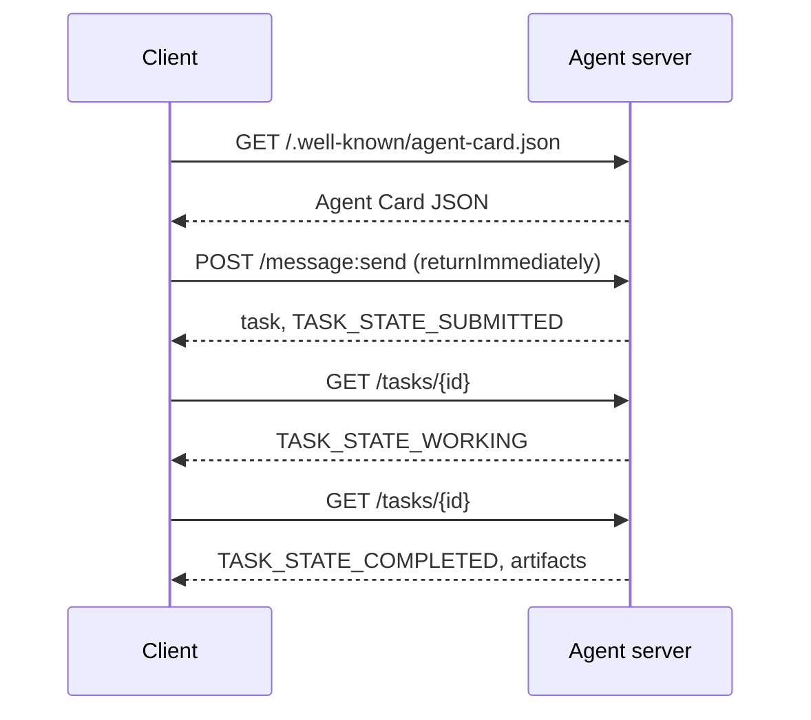

# A2A — The Agent-to-Agent Protocol

> Google announced A2A in April 2025; by April 2026 the spec is at https://a2a-protocol.org/latest/specification/ and 150+ organizations back it. A2A is the horizontal complement to MCP (Lesson 13): where MCP is vertical (agent ↔ tools), A2A is peer-to-peer (agent ↔ agent). It defines Agent Cards (discovery), tasks with artifacts (text, structured data, video), opaque task lifecycles, and auth. Production systems increasingly pair MCP with A2A. Google Cloud rolled A2A support into Vertex AI Agent Builder during 2025-2026.

**Type:** Learn + Build
**Languages:** Python (stdlib, `http.server`, `json`)
**Prerequisites:** Phase 16 · 04 (Primitive Model)
**Time:** ~75 minutes

## Problem

Your agent needs to call another agent on another system. How? You can expose an HTTP endpoint, define a bespoke JSON schema, and hope the other side speaks it. Every pair of agents becomes a custom integration.

A2A is the universal wire protocol for that call. Standard discovery, standard task model, standard transport, standard artifacts. Like HTTP+REST but for agents as first-class citizens.

## Concept

### The four elements

**Agent Card.** A JSON document at `/.well-known/agent-card.json` describing the agent: name, skills, `supportedInterfaces` (endpoint URL, protocol binding, protocol version), default input and output media types, and auth requirements (`securitySchemes` plus `securityRequirements`). Discovery happens by reading the card.

```http
GET /.well-known/agent-card.json HTTP/1.1
Host: agent.example.com
```

```json
{
  "name": "code-review-agent",
  "description": "Reviews Python and TypeScript code.",
  "version": "1.0.0",
  "supportedInterfaces": [
    {
      "url": "https://agent.example.com",
      "protocolBinding": "HTTP+JSON",
      "protocolVersion": "1.0"
    }
  ],
  "capabilities": {"streaming": false, "pushNotifications": false},
  "securitySchemes": {
    "bearer": {"httpAuthSecurityScheme": {"scheme": "Bearer"}}
  },
  "securityRequirements": [{"schemes": {"bearer": {"list": []}}}],
  "defaultInputModes": ["text/plain", "application/json"],
  "defaultOutputModes": ["application/json"],
  "skills": [
    {
      "id": "review-python",
      "name": "Review Python",
      "description": "Reviews Python code.",
      "tags": ["code-review", "python"]
    },
    {
      "id": "review-typescript",
      "name": "Review TypeScript",
      "description": "Reviews TypeScript code.",
      "tags": ["code-review", "typescript"]
    }
  ]
}
```

**Task.** The unit of work. An async, stateful object with a lifecycle: `TASK_STATE_SUBMITTED` → `TASK_STATE_WORKING` → `TASK_STATE_COMPLETED` / `TASK_STATE_FAILED` / `TASK_STATE_CANCELED`. A client sends a message, the server creates the task, and the client polls or subscribes for updates.

**Artifact.** The result type produced by a task. Text, structured JSON, image, video, audio. Artifacts are typed: each part carries one of `text`, `raw`, `url`, or `data` and can name its `mediaType`, so different modalities are first-class.

**Opaque lifecycle.** A2A does not prescribe *how* the remote agent solves the task. The client sees state transitions and artifacts; the implementation is free to use any framework.

### The MCP/A2A split

- **MCP** (Lesson 13): agent ↔ tool. The agent reads/writes via JSON-RPC to a tool server. Stateless by default.
- **A2A**: agent ↔ agent. Peer protocol; both sides are agents with their own reasoning.

Production multi-agent systems use both. An A2A peer calls MCP tools on its side. The split keeps the two concerns clean.

### Discovery flow



These are the HTTP+JSON binding routes, and every request carries `A2A-Version: 1.0`. By default `SendMessage` blocks until the task reaches a terminal or interrupted state, so a polling client sets `configuration.returnImmediately` to get the task back at once.

Or with streaming: `POST /message:stream` returns Server-Sent Events (a `task` first, then `statusUpdate` and `artifactUpdate` events), and `/tasks/{id}:subscribe` reattaches to a running task. The stream closes when the task reaches a terminal state; there is no `final` flag.

### Auth

A2A supports three common patterns:

- **Bearer token**: OAuth2 or opaque (`httpAuthSecurityScheme` or `oauth2SecurityScheme`).
- **mTLS**: mutual TLS; organizations prove identity to each other (`mtlsSecurityScheme`).
- **API key**: a key in a header, query parameter, or cookie (`apiKeySecurityScheme`).

Auth is declared in the Agent Card: `securitySchemes` names each scheme and `securityRequirements` says which ones a client must satisfy. Clients discover and comply.

### 150+ organizations by April 2026

Enterprise adoption drove A2A scale. The headline: A2A became the way enterprise agent systems cross trust boundaries. Google Cloud shipped Vertex AI Agent Builder A2A support; Microsoft Agent Framework supports it; most major frameworks (LangGraph, CrewAI, AutoGen) ship A2A adapters.

### Where A2A wins

- **Cross-organization calls.** Agent at company A calls agent at company B. Without A2A, every pair is a bespoke contract.
- **Heterogeneous frameworks.** LangGraph agent calls CrewAI agent calls custom Python agent. A2A normalizes.
- **Typed artifacts.** Video result, structured JSON, audio — all first-class.
- **Long-running tasks.** Opaque lifecycle + polling makes hours-long tasks straightforward.

### Where A2A struggles

- **Latency-sensitive micro-calls.** A2A's lifecycle is async. Sub-millisecond agent-to-agent does not fit; use direct RPC.
- **Tight-coupled in-process agents.** If both agents run in the same Python process, A2A's HTTP round-trip is overkill.
- **Small teams.** Spec overhead is real; internal-only agents may not need the formality.

### A2A vs ACP, ANP, NLIP

Several related specs emerged in 2024-2026:

- **ACP** (IBM/Linux Foundation) — predecessor to A2A, narrower scope.
- **ANP** (Agent Network Protocol) — peer-discovery-heavy, decentralized-first.
- **NLIP** (Ecma Natural Language Interaction Protocol, standardized December 2025) — natural-language content type.

A2A is the most-adopted peer protocol as of April 2026. See arXiv:2505.02279 (Liu et al., "A Survey of Agent Interoperability Protocols") for the comparison.

```figure
sw-agent-card-discovery
```

## Build It

`code/main.py` implements an A2A-minimal server and client using `http.server` and JSON, on the 1.0 HTTP+JSON binding. The server:

- exposes `/.well-known/agent-card.json`,
- accepts `POST /message:send`,
- manages task state,
- returns artifacts on `GET /tasks/{id}`.

The client:

- fetches the Agent Card,
- sends a message with `returnImmediately`,
- polls until completion,
- reads the artifact.

Run:

```
python3 code/main.py
```

The script starts the server in a background thread, then runs the client against it. You see the complete flow: discovery, submit, poll, artifact.

## Use It

`outputs/skill-a2a-integrator.md` designs an A2A integration: Agent Card contents, task schemas, auth choice, streaming vs polling.

## Ship It

Checklist:

- **Pin the spec version.** A2A is still evolving; every `supportedInterfaces` entry declares its `protocolVersion`, and clients send `A2A-Version: 1.0`.
- **Idempotent task creation.** Duplicate submissions (network retries) should produce one task. Deduplicate on the client's `messageId`.
- **Artifact schemas.** Declare what shapes the agent returns; consumers should validate.
- **Rate limits + auth.** A2A is public-facing; apply standard web security.
- **Dead-letter for failed tasks.** Inspect patterns over time for recurring failure types.

## Exercises

1. Run `code/main.py`. Confirm the client discovers the server and receives the correct artifact.
2. Add a second skill to the server (e.g., "summarize"). Update the Agent Card. Write a client that picks the skill based on task type. A 1.0 request has no skill field, so the server routes on the message parts.
3. Implement `POST /message:stream`: answer with Server-Sent Events (a `task` first, then `statusUpdate` events) and close the stream at a terminal state. What does the client need to do differently?
4. Read the A2A spec (https://a2a-protocol.org/latest/specification/). Identify three things the spec mandates that this demo does not implement.
5. Compare A2A (Agent Card discovery) to MCP (server-side capability listing via `listTools`). What is the tradeoff between self-describing agents and capability-probing?

## Key Terms

| Term | What people say | What it actually means |
|------|----------------|------------------------|
| A2A | "Agent-to-agent" | Peer protocol for agents to call other agents across systems. Google 2025. |
| Agent Card | "The agent's business card" | JSON at `/.well-known/agent-card.json` describing skills, `supportedInterfaces`, auth. |
| Task | "The unit of work" | Async stateful object with a lifecycle; artifacts produced on completion. |
| Artifact | "The result" | Typed output: text, structured JSON, image, video, audio. First-class media. |
| Opaque lifecycle | "How it's solved is the agent's business" | Client sees state transitions; server is free to choose framework/tools. |
| Discovery | "Finding the agent" | `GET /.well-known/agent-card.json` returns the card. |
| MCP vs A2A | "Tools vs peers" | MCP: vertical agent ↔ tool. A2A: horizontal agent ↔ agent. |
| ACP / ANP / NLIP | "Sibling protocols" | Adjacent specs; A2A is the most-adopted 2026. |

## Further Reading

- [A2A specification](https://a2a-protocol.org/latest/specification/) — the canonical spec
- [A2A v1.0.1 release](https://github.com/a2aproject/A2A/tree/v1.0.1): the tagged `docs/specification.md` and `specification/a2a.proto` this lesson follows
- [Google Developers Blog — A2A announcement](https://developers.googleblog.com/en/a2a-a-new-era-of-agent-interoperability/) — April 2025 launch post
- [A2A GitHub repo](https://github.com/a2aproject/A2A) — reference implementations and SDKs
- [Liu et al. — A Survey of Agent Interoperability Protocols](https://arxiv.org/html/2505.02279v1) — MCP, ACP, A2A, ANP comparison
